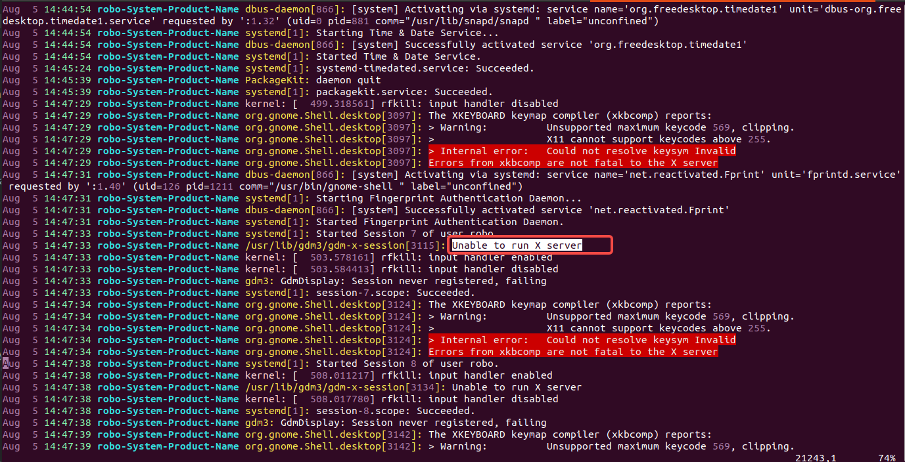

# linux

- [命令](#命令)

---
### 命令
#### 进不去桌面
~~~
  进入tty
  ctrl+alt+F1-6
  查看日志,提取关键信息
  vim /var/log/syslog
~~~

##### 压缩与解压缩
~~~
压缩test文件
tar -zcvf test.tar /usr/test
解压
tar -zxvf test.tar
~~~

##### 查看文件占用大小
~~~
du -h --max-depth=0 *
~~~

##### .deb文件安装与删除
~~~
sudo apt install path_to_deb_file

sudo dpkg -i path_to_deb_file

dpkg -r todesk

dpkg -l todesk 

killall snap-store

sudo snap refresh snap-store
~~~

##### 系统架构
~~~
lscpu
x86_64:表示基于 Intel 或 AMD 的 64 位架构
ARM:
~~~

#### 查找目录下的文件中包含具体字段
~~~
grep -r "redis" /path/to/directory
~~~

#### 远程服务器免密登录
*  时间：20230925
*  功能：免密登录、复制文件
*  本地生成密钥，已经生成过则不需要：
    * ssh-keygen -t rsa
*  设置远程服务器密钥验证：
    * scp ~/.ssh/id_rsa.pub user@remote.server.com:~/.ssh/authorized_keys
    * scp ~/.ssh/id_rsa.pub root@159.75.92.101:~/.ssh/authorized_keys