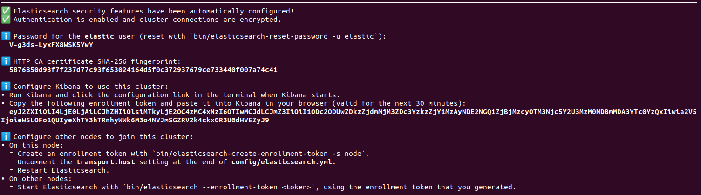

# elastic

- [组件说明](#组件安装)

---

### 组件安装
* 官网安装
* https://www.elastic.co/guide/en/elasticsearch/reference/current/targz.html
* 
* 启动
* ./elasticsearch
~~~
✅ Elasticsearch security features have been automatically configured!
✅ Authentication is enabled and cluster connections are encrypted.

ℹ️  Password for the elastic user (reset with `bin/elasticsearch-reset-password -u elastic`):
  V-g3ds-LyxFX8WSK5YwY

ℹ️  HTTP CA certificate SHA-256 fingerprint:
  5876850d93f7f237d77c93f653024164d5f0c372937679ce733440f007a74c41

ℹ️  Configure Kibana to use this cluster:
• Run Kibana and click the configuration link in the terminal when Kibana starts.
• Copy the following enrollment token and paste it into Kibana in your browser (valid for the next 30 minutes):
  eyJ2ZXIiOiI4LjE0LjAiLCJhZHIiOlsiMTkyLjE2OC4zMC4xNzI6OTIwMCJdLCJmZ3IiOiI1ODc2ODUwZDkzZjdmMjM3ZDc3YzkzZjY1MzAyNDE2NGQ1ZjBjMzcyOTM3Njc5Y2U3MzM0NDBmMDA3YTc0YzQxIiwia2V5IjoieW5LOFo1QUIyeXhTY3hTRnhyWWk6M3o4NVJmSGZRV2k4ckx0R3U0dHVEZyJ9

ℹ️  Configure other nodes to join this cluster:
• On this node:
  ⁃ Create an enrollment token with `bin/elasticsearch-create-enrollment-token -s node`.
  ⁃ Uncomment the transport.host setting at the end of config/elasticsearch.yml.
  ⁃ Restart Elasticsearch.
• On other nodes:
  ⁃ Start Elasticsearch with `bin/elasticsearch --enrollment-token <token>`, using the enrollment token that you generated.
~~~
* 数据同步
* monstache

